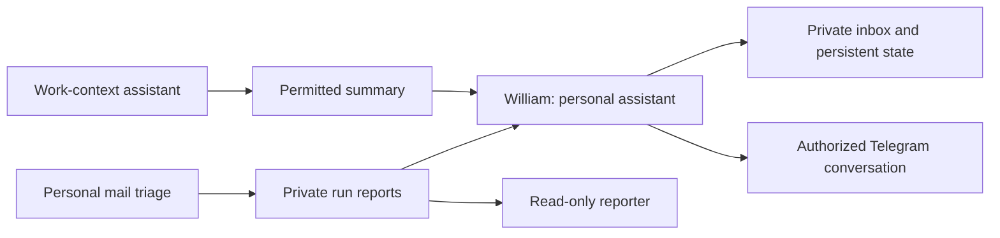

# The agent team

The source setup includes a personal assistant named **William**, a mail-triage worker called **maileman**, lightweight reporters, and a separate work-context chief-of-staff agent. These are roles with different tools, data and action scopes.

## William: continuity and follow-through

The inspected definition describes conversational turns and one-shot heartbeat ticks. It reads recent state before responding, tracks commitments outside the chat, and reads collaborators’ reports or inbox drop-files. In this design William is the designated Telegram contact for proactive personal-assistant updates, reducing duplicate notifications from every worker.

A heartbeat is one bounded run, not an infinite internal loop. The scheduler determines the cadence. Persist what changed and what was delivered; avoid appending meaningless “nothing happened” entries forever. Deduplicate reminders and enforce recipient scope.

The public reproduction starts with an empty private state directory. It does not reproduce Miguel’s contacts, calendar, messages, life details, bill records or memory.

## Mail worker and reporter

The mail worker classifies a scoped inbox selection, records bucket counts and surfaces action items. The inspected setup uses distinctions such as “must reply,” “must act” and “must read.” A report tells the assistant what changed.

A reporter only reads those saved reports. Asking “what happened today?” should not accidentally rerun classification or mutate the mailbox. Reproduce this separation before adding more clever routing.

The original worker has narrow mailbox-write rules. This repo’s starter contract defaults to read-only dry runs; each new owner must explicitly configure which labels, archives or other actions are authorized. Never copy another person’s sender filters or account IDs.

## Work-context assistant

Keep employer integrations and personal integrations separate. A work assistant may summarize meetings, engineering signals or commitments only within its authorized scope. Share the smallest permitted summary with another role, rather than giving every personal agent all work data.

## Adding another agent

Use [the agent contract](../templates/agent-contract.md): role, inputs, allowed reads, allowed writes, delivery channel, schedule, state, deduplication, failure policy and success checks. Test one manual run before scheduling. Run only one active scheduler for a role during migration.

“Mika” was mentioned in the request for this playbook, but no earlier matching agent definition or transcript reference was identified in this inspection. Its role is intentionally not invented. Add it once its spelling/location and operating contract are confirmed.

## Rebuild checklist

1. Create separate private state for each role.
2. Connect only the owner’s authorized accounts through normal login flows.
3. Run one read-only task and inspect the report.
4. Test stale input, duplicate input, missing credentials and restart behavior.
5. Agree on outbound actions and recipients before enabling any.
6. Add a scheduler with a bounded tick and a durable last-run record.
7. Confirm only one worker is active and document how to stop it.
