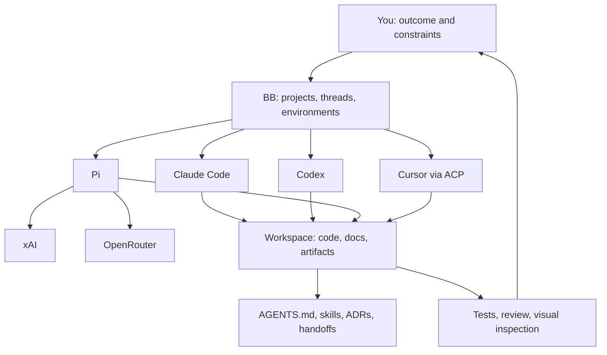

# Architecture

A model produces reasoning and text. A harness gives it a task loop, tools, context and permissions. BB organizes harness sessions across projects and environments. An integration provides a capability such as browsing, image generation or reading an authorized mailbox. Choosing a text model alone does not install those capabilities.

A BB project points to a repository. A thread is an agent conversation. An environment selects a checkout or worktree on a machine. Multiple threads can share files; they do not automatically share all context. Give each worker a clear responsibility and use handoffs or messages for coordination.

The source setup keeps BB state under `bb/data`, local Codex and Pi installs under their own directories, and selected skills in `.bb/skills`. The portable recipe uses `state/claude`, `state/codex` and `state/pi` for new profiles so installation cannot silently adopt another person’s credentials.

Durable memory is ordinary files with a purpose: AGENTS.md for rules, ADRs for decisions, handoffs for session state, run reports for recurring work. An assistant should read the relevant files when it resumes. A bigger context window does not replace this discipline.

Herdr is an optional terminal-orchestration layer. It is not required for BB and was not verified as installed during this snapshot. A VPS is a later deployment location, not a capability granted by opening the laptop remotely.
