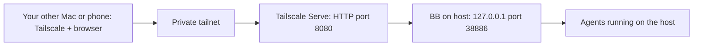

# How I access my BB setup through Tailscale

I installed Tailscale on my Macs and used Tailscale Serve to reach BB through my private tailnet. The short-form walkthrough also describes using the phone as a client. The agent work still runs on the host Mac; the other device opens its BB interface in a browser.

## My actual configuration

Read-only inspection on 2026-10-07 confirmed Tailscale **1.102.3**, an HTTP listener on **8080**, and a `/` reverse-proxy handler forwarding to **http://127.0.0.1:38886**. Funnel was disabled. Both BB’s loopback URL and the configured Serve hostname returned HTTP 200 when checked from the host. A second-device browser session was not retested during this documentation update.



The original setup notes record that tailnet HTTPS certificates were not enabled, so we explicitly selected HTTP port 8080. This is the configuration I reproduced below. The `http://` URL does not provide browser TLS; traffic between Tailscale devices still travels over the encrypted Tailscale connection. It does not mean BB should be opened to the public internet or bound to every LAN interface. [How Tailscale works](https://tailscale.com/kb/1151/what-is-tailscale).

## Reproduce it with your own devices

### 1. Install and connect Tailscale

Install the official Tailscale app on the Mac running BB and on each device you want to use to access it. Sign in to your own tailnet, approve the platform’s VPN/network permissions and connect both devices. Follow the [official quickstart](https://tailscale.com/docs/how-to/quickstart).

Tailscale is an explicit exception to this project’s repo-local installation rule: it needs a system network component. On this source Mac, the app is in `/Applications/Tailscale.app` and the CLI is on PATH. Do not copy another person’s Tailscale state or login credentials.

### 2. Check BB locally

Start BB through your installation’s launcher if it is not already running. For the portable recipe:

```bash
"$HOME/Coding/AI-native/workstation/bb/bb.sh"
```

The original source setup uses `~/Coding/AI-native/bb/bb.sh` instead. Then verify:

```bash
curl --fail --silent --output /dev/null --write-out '%{http_code}\n' http://127.0.0.1:38886/
```

Expected here: `200`. Resolve any local startup or port problem before adding a network route. Keep BB on loopback. This interface can operate coding agents and execute commands, so restrict which users/devices can reach it.

### 3. Inspect existing routes, then add the BB route

Run these in your normal host terminal:

```bash
tailscale status
tailscale serve status
```

If port 8080 already serves something else, preserve it and deliberately select an unused port. To reproduce my configuration on a free port 8080:

```bash
tailscale serve --bg --http=8080 http://127.0.0.1:38886
tailscale serve status
```

Use **Serve**, which is scoped to your tailnet, and keep Funnel disabled. Apply tailnet access rules so only the intended users/devices can reach this host on port 8080; tailnet membership alone is not a substitute for choosing access scope. [Serve access controls](https://tailscale.com/docs/features/tailscale-serve).

`--bg` keeps the Serve configuration running in the background and allows it to resume after Tailscale restarts. It does not start BB or keep the Mac awake. The listener and proxy syntax are documented in the [Serve CLI reference](https://tailscale.com/docs/reference/tailscale-cli/serve).

### 4. Open the address on the other device

Copy the URL from **your own** `tailscale serve status`. It has this shape:

```text
http://YOUR-HOST.YOUR-TAILNET.ts.net:8080/
```

The hostname above is a placeholder. Connect Tailscale on the client, then open the actual URL in its browser. Keep the `http://` scheme and `:8080` port for this configuration. You are opening the host’s BB, not starting another BB instance on the client.

In the original setup, the hostname worked while requesting the numeric tailnet IP returned 404. Use the `.ts.net` hostname printed by Serve rather than substituting the IP. Verify that the expected project loads and the thread interface works, not only that an HTTP response is returned.

### 5. Open and download artifacts

Use BB’s Files → Download action through that same browser origin. If an agent generates a download route, it must preserve the owning thread/host and use this actual origin, including port 8080. The remote client’s `localhost` is not the machine running BB. See [remote downloads](operations.md).

## Troubleshooting from this setup

| Symptom | What to check |
| --- | --- |
| `Failed to load preferences` from an agent tool | The sandbox can prevent the macOS CLI from reading its preferences. In this audit, the same read-only commands worked outside the agent sandbox. Check in your host terminal before assuming Tailscale is broken. |
| Default Serve command stalls during setup | The original notes encountered this with HTTPS certificates disabled. Use the explicit HTTP command above for this setup; an HTTPS deployment is a separate configuration choice. |
| Tailnet IP gives 404 | Use the actual Serve hostname and correct port. |
| Local BB works, remote browser does not | Check both Tailscale connections, host availability, DNS, access rules and the current Serve route. |
| Phone can see BB but cannot download a file | Verify the actual browser-facing URL, not a host-local link. |
| Connection disappears when the host sleeps | BB and its agents still need the host awake and online. Remote access does not move computation to the client. |

Tailscale SSH is not required for this browser workflow. Enabling SSH will not fix a Serve or BB URL problem.

## Turn off only this route

When you deliberately want to remove the BB route, inspect the current routes first, then use:

```bash
tailscale serve --bg --http=8080 http://127.0.0.1:38886 off
tailscale serve status
```

This follows the documented per-listener disable form. Avoid resetting all Serve configuration if you have other services. [Serve CLI reference](https://tailscale.com/docs/reference/tailscale-cli/serve).

## Relationship to BB Connect

This was my original private-network access method. BB’s built-in Remote access plugin is also enabled in the later snapshot and offers a separate connection path. Choose the URL for the method you are actually using; a BB Connect origin and a Tailscale origin are not interchangeable.

The guide combines the original bootstrap handoff, the short-form walkthrough and live read-only Serve inspection. Private hostnames, tailnet identifiers and device/account details have been replaced with placeholders. No network settings were changed to write this guide.
